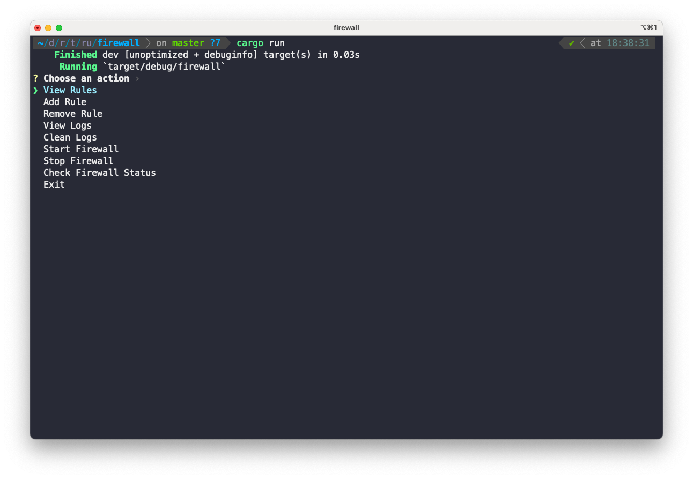

# Simple Example of Firewall CLI in Rust

## Overview
This project is a step-by-step guide to building a simple, command-line firewall application in Rust. It allows users to define rules for accepting or dropping incoming network packets based on specified criteria.

Based on the article with the step-by-step guide here:  [Implementing a Firewall in Rust](https://medium.com/@luishrsoares/implementing-a-firewall-in-rust-12b9f04228f5). Improved by proper file structure, error handling, and logging.

## Prerequisites
Before you begin, ensure you have Rust installed on your system. Follow the [Rust Installation Guide](https://www.rust-lang.org/tools/install) for guidance.

## Getting Started
Clone this repository and navigate into the project directory:

    git clone [URL to your repository]
    cd firewall
    cargo run

## Screenshots

## Features
- **Rule Definition**: Define rules based on source IP, destination port, and other criteria.
- **Rule Management**: Add, remove, and list firewall rules.
- **Iptables Integration**: Update iptables based on defined rules.
- **Command-Line Interface**: Easy-to-use CLI for managing the firewall.
- **Packet Processing**: Process incoming packets and apply rules.
- **Logging**: Log accepted and dropped packets for monitoring.
- **Error Handling**: Gracefully handle errors and provide informative messages.

## License
This project is licensed under the MIT License.